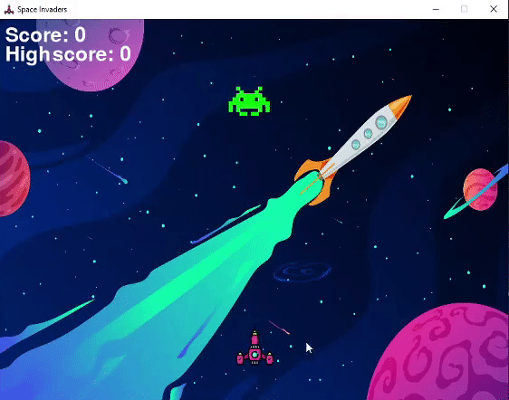
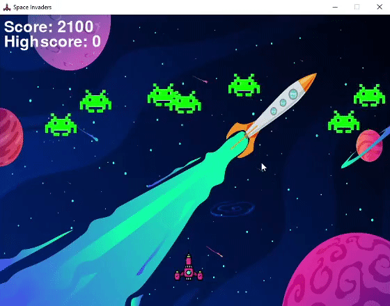

# Space Invaders Pygame
This is an implementation of the popular Atari and NES Space Invaders arcade game using Python with the Pygame module.

## Installation

### Windows:
1. Ensure that you have _python_ and _pip_ installed on your machine. You can install from here: https://www.python.org/downloads/
2. Clone this repository to a local directory or download it as a zip and unzip it.
3. Open the command prompt and _cd_ to the directory that has the _spaceInvader.py_ file.
4. Use the following command in command prompt to install _Pygame_: `pip install pygame`
5. Use the following command in command prompt to begin the game: `python spaceInvader.py`

## Concept
My implementation of the Space Invaders game holds similar concepts to the original game. For example, the player spaceship shoots the aliens
and when the lasers hit the aliens the user will gain points and level up which increases the game difficulty. The game ends once the aliens gets
to the same row as the spaceship.

## Features 
* The player can be moved _left_ or _right_ using the `A` and `D` keys, respectively
* The player can shoot the aliens by using the `right click` on a mouse
* After the player has cleared all the all the aliens, the user levels up and the number of aliens will increase by 1 and aliens speed will increase as well
* The game has sound effects for when the user shoots and when a laser hits an alien
* When an alien gets hit by a laser the users score will increase. When the game ends the users highscore will increase if that rounds score is the users highest score
* When the game ends a `Play Again` button will appear so that the user can restart the game

## Gameplay
This is a short gameplay of the first 3 levels. After you clear all the aliens you move up a level and more aliens will spawn.

This is a short gameplay that demonstrates how the game ends and how you can play the game again and your highscore will be updated.

